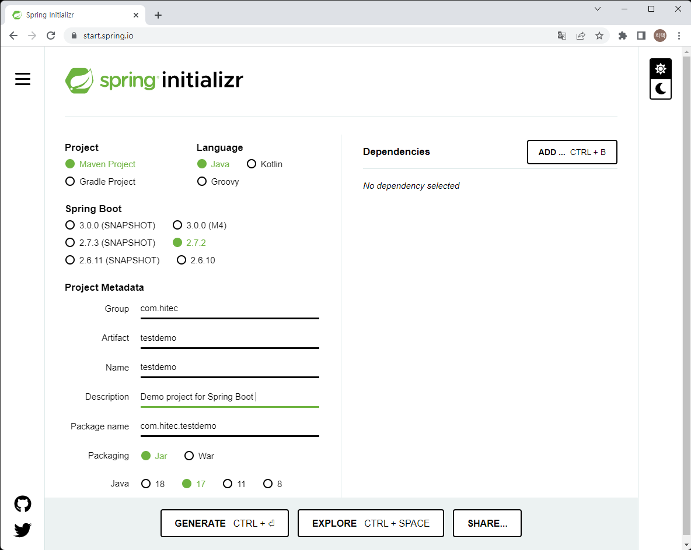
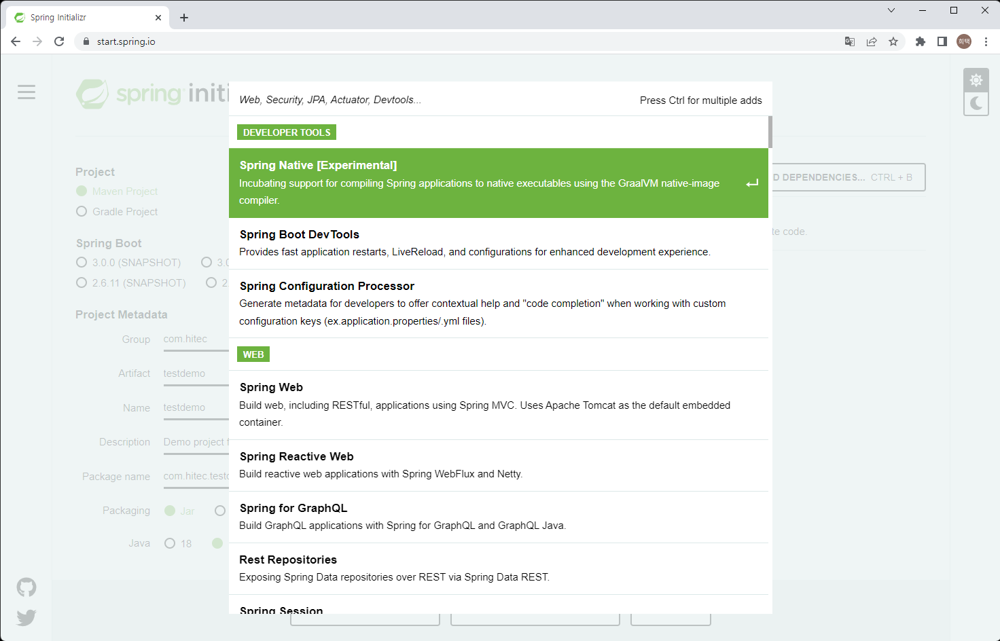

# Spring Boot 로 개발 시작하기

1. [Spring Initializr](https://start.spring.io/, "Spring Initializr") 
    * 스프링 관련되 프로젝트를 손쉽게 생겅해주는 사이트
       
2. 항목선택
    > Project -> 메이블, 그레들 중 선택
    > Language -> java, Kotlin, Groovy 중 선택
    > SpringBoot 버전 선택
    > 프로젝트 메타데이터 선택
    > jar war 패키징 선택 (둘다 가능)
    > java 버전 선택
3. dependencies 선택
    > 내 프로젝트에 맞게 라이브러리를 선택
    > 우측 상단의 ADD DEPENDENCIES 버튼 선택
       
    > 컨트롤 키를 누르며 dependency 를 선택
    > 웹 개발을 하기 위해선 Spring Web dependency 필수      
4. 아래 버튼 중 GENERATE 버튼을 선택하여 다운로드
5. 다운로드 받은 파일을 적절한 위치에 압축 해제
6. 비주얼스투디오 코드로 압축 해제한 디렉토리를 오픈 (open folder)   
7. [소스형상관리](../DevEnv/소스형상관리.md) 를 진행하였으면 remote 저장소에서 내려받은 위치에 압축 파일 해제   
       
8. visual studio code로 열어서 개발 (자신에게 익숙한 개발 IDE 사용 ex. eclipse, intelliJ 등 )
9. 소스 형상관리를 진행하였으면 원격 저장소로 push   

---

* mvn 혹은 gradle을 로컬 PC에 설치되어 있다면 local PC에서 웹 서버를 실행 해 볼 수 있음   
```
mvn spring-boot:run
```

---

* 웹 테스트를 위해 간단한 코드 추가   
  controller 디렉토리 생성 후 TestContreoller.java 파일 생성   


```java
package com.hitec.testdemo.controller;

import org.springframework.web.bind.annotation.GetMapping;
import org.springframework.web.bind.annotation.RestController;

@RestController
public class TestController {
    
    @GetMapping("/test")
    public String test() {
        return "test Good";
    }
}

```

* dockernizer 하기위한 dockerfile
```Dockerfile
FROM openjdk:11.0.16-jre

ARG APP_FILE

RUN echo ${APP_FILE}
RUN mkdir /logs
RUN chown 1000:1000 /logs
RUN mkdir /app
RUN chown 1000:1000 /app

USER 1000:1000
WORKDIR /app
COPY  --chown=1000:1000 ${APP_FILE} /app/app.jar

ENTRYPOINT ["java", "-jar", "/app/app.jar"]
```