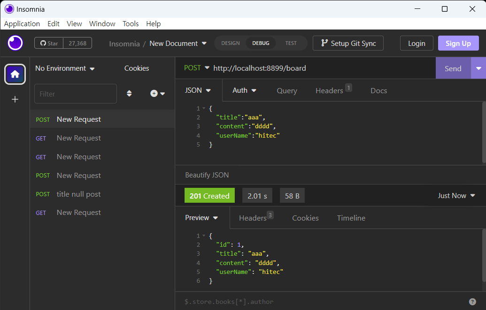

# MapStruct 세팅 #   
여기 블로그에서 순서대로 진행하셨다면    
웹을 통해 BoardDTO 데이터를 받는 부분   
JPA를 통해 Board entity 를 저장하고 가져오는 부분   
으로 진행을 하였습니다. 

여기서는 웹을 통해 가져온 데이터를 DB 에 저장하고   
DB에 저장된 데이터를 웹으로 가져가는 부분을 진행하려고합니다.    

그러기위해서 BoardDTO 와 Board 클래스로 다른 객체를 매핑하여야합니다. 
객체간의 매핑을 위해 mapstruct를 사용하려고 합니다. 

> JPA 의 entity를 바로 웹을 통해 받거나 웹으로 내보낼 수 있으나   
> entity 에는 다른 entity와의 연결, entity만의 설정   
> 웹에서 요청할 때 필요치 않은 항목 등으로 인해 오동작의 우려가 있어   
> 웹에서의 요청과 JPA 에서의 entity는 분리하기로 하였습니다.    


## 메이븐 설정 ##  

pom.xml 파일에 dependency 추가
```xml
<!-- mapstruct for object matching -->
<dependency>
    <groupId>org.mapstruct</groupId>
    <artifactId>mapstruct</artifactId>
    <version>1.5.3.Final</version>
</dependency>
```

pom.xml 파일에 maven-compiler-plugin을 추가하며 lombok과 mapstruct를 설정한다.   
```xml
<plugin>
    <groupId>org.apache.maven.plugins</groupId>
    <artifactId>maven-compiler-plugin</artifactId>
    <version>3.6.0</version>
    <configuration>
        <source>17</source>
        <target>17</target>
        <annotationProcessorPaths>
            <path>
                <groupId>org.projectlombok</groupId>
                <artifactId>lombok</artifactId>
                <version>1.18.24</version>
            </path>
            <path>
                <groupId>org.mapstruct</groupId>
                <artifactId>mapstruct-processor</artifactId>
                <version>1.5.3.Final</version>
            </path>
        </annotationProcessorPaths>
        <compilerArgs>
            <arg>-parameters</arg>
        </compilerArgs>
    </configuration>
</plugin>
```

## Sample Code ##
DB 의 테이블에 매핑되는 Board 이름의 Entity를 만든다.    
```java
@Mapper(unmappedTargetPolicy = ReportingPolicy.IGNORE)
public interface BoardDtoMapper {
    BoardDtoMapper MAPPER = Mappers.getMapper(BoardDtoMapper.class);

    /**
     * board 객체를 boardDto 에 매핑
     * @param board
     * @return
     */
    @Mapping(target="id", source="board.id")
    @Mapping(target="title", source="board.title")
    @Mapping(target="content", source="board.content")
	BoardDTO boardToBoardDto(Board board);
    /**
     * boardDto 객체를 Board 에 매핑 
     * @param boardDto
     * @return
     */
    @Mapping(target="id", source="boardDTO.id")
    @Mapping(target="title", source="boardDTO.title")
    @Mapping(target="content", source="boardDTO.content")
    Board boardDtoToBoard(BoardDTO boardDto);
}
```
> interface 로 되어 있으며 컴파일단계에서 소스가 generation 된다.    
> 컴파일단계에 정의가 됨으로 runtime 에 매핑하는 modelmapper 보다 많이 빠르다고 한다.     
> unmappedTargetPolicy=ReportingPolicy.IGNORE 를 통해 매칭되지 않은 객체는 무시하도록 했다.    
> @Mapping 을 통해 객체를 매핑한다.   
> @AfterMapping 을 사용하면 매핑 이후에 추가적인 로직을 추가할 수 있다.    


controller 를 jpa 서비스를 사용하도록 수정한다. 
```java
@RestController
public class HitecController {

    BoardService boardService;

    @Autowired
    public HitecController(BoardService boardService){
        this.boardService = boardService;
    }

    @PostMapping("/board")
    @ResponseStatus(HttpStatus.CREATED)
    public BoardDTO saveBoard(@Valid @RequestBody BoardDTO boardDTO){
        Board board = boardService.saveBoard(BoardDtoMapper.MAPPER.boardDtoToBoard(boardDTO));
	    return BoardDtoMapper.MAPPER.boardToBoardDto(board);
    }

    @GetMapping("/boards")
    public List<BoardDTO> getAllBoard(){
        List<Board> boards = boardService.getBoardList();
        return boards.stream().map(BoardDtoMapper.MAPPER::boardToBoardDto).toList();
    }
}
```
> boardService를 Autowired 를 통해 주입한다.    
> 단순히 저장하고, 모든 항목을 가져오는 두개의 메소드를 만들었다.    
> mapStruct 는 BoardDtoMapper.MAPPER를 통해 가져올 수 있으며 매핑 함수를 실행한다.    


## mapstruct ##
자세한 사항은 다음 참조 
[Map Struct](https://mapstruct.org/documentation/stable/reference/html/ "Map Struct")    

## Test ##
   
> post method로 board 정보를 입력하는 요청을 했다.    
> 정상적으로 201 httpstatus 를 받았고, id가 1이 추가된 결과를 받았다.    


   
> 앞 테스트에 이어서 get method 로 boards 를 요청했다.    
> 정상적으로 200 httpstatus를 받았고, 앞서 입력한 board 의 정보가 함께 나오는 것을 볼 수 있다.    
